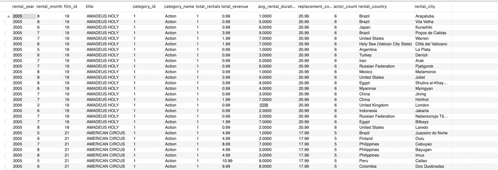

# Films Revenue Analysis Using SQL and Tableau

## Overview

This project explores film rental performance using data from the Sakila Database, focusing on key metrics such as category revenue, rental frequency, and regional trends. The analysis combines data warehousing with SQL and visual analytics with Tableau to identify insights into business performance, customer demand, and content profitability.

The study provides a structured data mart, generates analytical queries, and visualizes business outcomes through interactive Tableau dashboards.

---

## Schema and Data Integration

The Sakila database was used as the foundation to design a film-focused data warehouse. Multiple relational tables were integrated into a consolidated summary table named **film_summary**, enabling cross-sectional analysis across categories, rentals, and geographies.

### Schema Diagram

### Joined Tables

The warehouse integrates data from:

* `film`, `category`, `rental`, `payment`, `inventory`, and `customer`
* Additional links with `actor`, `city`, and `country`

This design allows analysis of film performance across rental counts, geography, and financial performance.

---

## SQL Analysis

A series of analytical SQL queries were developed to answer core business questions:

1. Which film categories generate the highest revenue?
2. What are the top-performing films by total revenue and rentals?
3. Which actors appear in the most profitable films?
4. Which countries and cities contribute the most to revenue?
5. How do rental trends vary over time and across genres?
6. What revenue differences exist between low-, mid-, and high-budget films?

These outputs were exported and visualized in Tableau to create an integrated analysis.

---

## Visual Insights

### Top 5 Revenue-Generating Categories

High-performing categories such as **Sports**, **Sci-Fi**, and **Animation** led global earnings, reflecting audience preference for dynamic and visually driven genres.

---

### Top 10 Revenue-Generating Films

A small number of films accounted for a disproportionate share of total revenue, indicating the dominance of select high-performing titles.

---

### Top Actors by Film Revenue

A handful of actors consistently appeared in top-grossing films, emphasizing the impact of casting strategy on profitability.

---

### Top 10 Countries by Revenue

Revenue was concentrated in **India**, **China**, and the **United States**, showing the strong influence of global streaming and rental markets.

---

### Most Rented Films by Category

Consumer rental behavior varied widely by category, with family, sports, and comedy genres achieving strong repeat rentals.

---

### Highest-Grossing Film per Category

Across all categories, the highest-grossing titles demonstrated strong alignment between production investment and audience return.

---

### Top Rental Cities

Urban regions recorded significantly higher rental frequencies, supported by digital accessibility and larger customer bases.

---

### Revenue by Budget Category

High-budget productions delivered the largest revenue returns, confirming that investment scale correlates with global performance.

---

### Geographic Revenue Distribution

A spatial view of total revenue shows key international markets driving the bulk of performance, highlighting regional strengths.

---

### Monthly Rental Trends by Category

Rental activity followed a seasonal pattern, with mid-year peaks representing high consumer engagement periods.

---

### Rental Performance by Genre

Action, Family, and Sports films recorded the highest rental volumes, confirming balanced cross-genre interest.

---

### Top 5 Most Rented Films

Titles such as *Bucket Brotherhood* and *Rocketeer Mother* led global rental counts, sustaining consistent demand across time.

---

## Tableau Dashboard

The final dashboard integrates all visualizations into a unified interface for exploration and presentation.
[View Tableau Dashboard (Public Link)](#)

---

## Key Insights

* High-budget films generate the majority of global revenue.
* Family and action genres consistently perform well across markets.
* Regional rental demand aligns with market size and access to digital media.
* Mid-year peaks in rental activity suggest timing-based marketing opportunities.
* The data warehouse approach streamlines analytical reporting across all business units.

---

## Project Files

| Folder     | Description                                 |
| ---------- | ------------------------------------------- |
| `data/`    | Cleaned datasets used for visualization     |
| `sql/`     | SQL scripts for schema, joins, and analysis |
| `tableau/` | Tableau workbook file (`.twb`)              |
| `images/`  | Exported charts and dashboards              |
| `reports/` | Final written report and documentation      |

---

## Conclusion

This project demonstrates the integration of SQL-based data warehousing with Tableau visualization to derive meaningful insights from raw transactional data. The resulting analytics framework supports strategic decisions in film acquisition, pricing, and global distribution.

